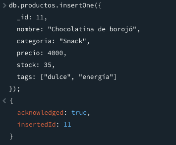
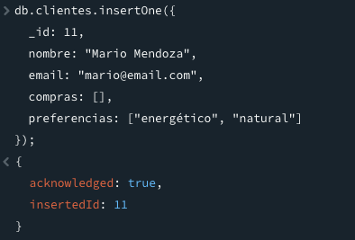
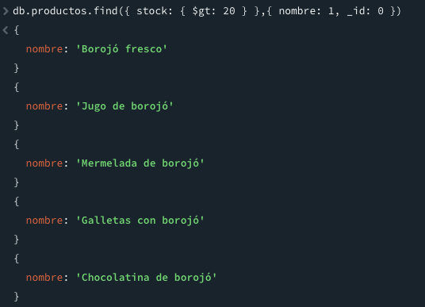
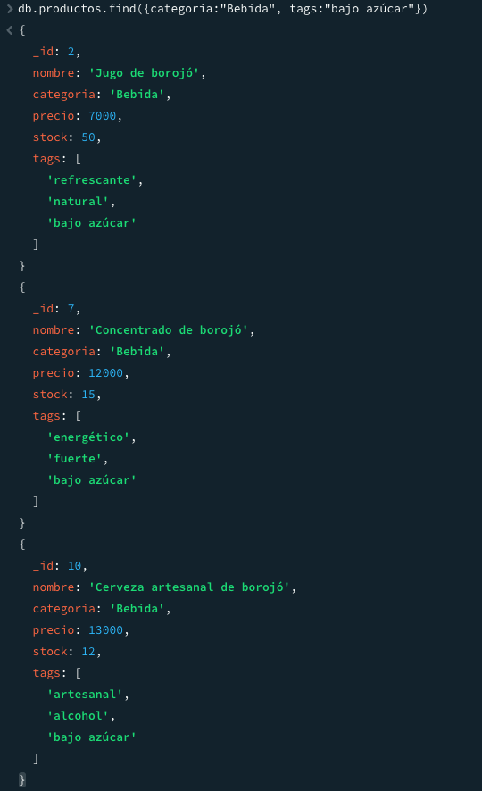
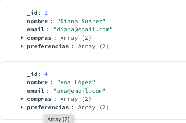
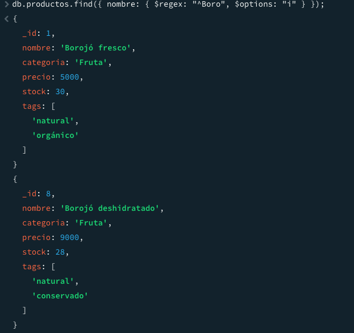
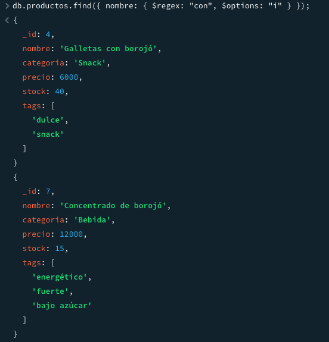
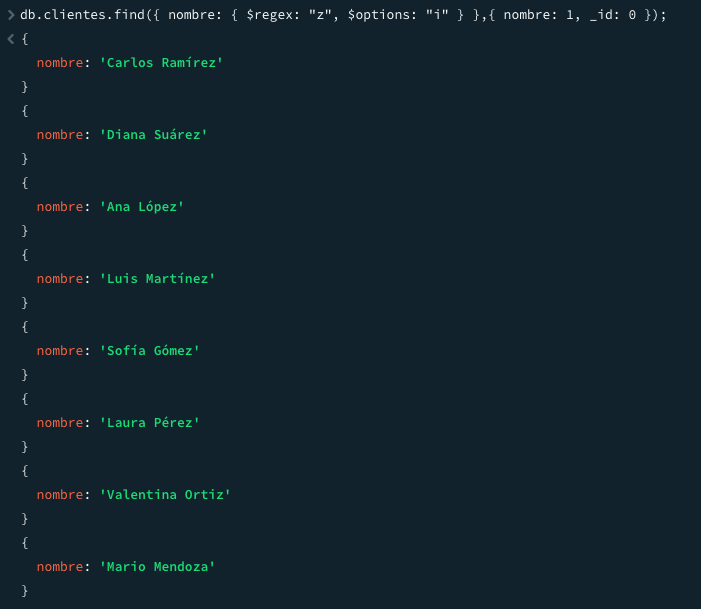

# 🛍️ La tienda del borojó

Este proyecto consiste en el modelado y gestión de una base de datos NoSQL con MongoDB para una tienda temática especializada en productos derivados del borojó. El escenario incluye colecciones de productos, clientes, ventas, inventario y proveedores. A través del desarrollo de consultas, manipulaciones y operaciones avanzadas, se busca aplicar y fortalecer los conceptos fundamentales de MongoDB.

---

## 📦 Modalidad de Entrega

- Trabajo individual.
- Repositorio en GitHub con:
  - Scripts `.js` con los ejercicios resueltos.
  - Archivo `README.md` con documentación clara y organizada.
  - Capturas de pantalla como evidencia de ejecución de consultas.

---

## 📌 Descripción del Escenario

La tienda vende productos elaborados a base de borojó (fruta autóctona del Pacífico colombiano), con clientes que tienen preferencias específicas, proveedores organizados por producto, un inventario controlado por lotes, y un historial de ventas. Esta estructura permite realizar diversas consultas útiles para la operación del negocio y análisis estratégico.

---

## 🚀 Instrucciones de Ejecución

1. **Requisitos previos:**
   - MongoDB instalado (versión recomendada: 6.x)
   - MongoDB Shell o Compass

2. **Carga de datos inicial:**
   - Insertar los datos base en las colecciones `productos`, `clientes`, `ventas`, `proveedores` e `inventario` desde archivos `.json` o mediante comandos en Mongo Shell.

3. **Ejecución de scripts:**
   - Los archivos `.js` están organizados por tema.
   - Puedes ejecutar cada script por separado usando MongoDB Shell o adaptarlos con Node.js y el driver oficial.

---

## 📋 Listado de Ejercicios

| Tema                           | Descripción                                                                 |
|-------------------------------|-----------------------------------------------------------------------------|
| Inserciones                   | Agregar un nuevo producto y cliente.                                       |
| Lecturas                      | Consultas simples como productos con stock alto y clientes sin compras.    |
| Actualizaciones               | Cambios sobre el stock y tags de productos.                                |
| Eliminaciones                 | Eliminación por condiciones específicas.                                   |
| Expresiones Regulares


### 🚀 Inserción

1. Insertar un nuevo producto llamado `"Chocolatina de borojó"`, categoría `"Snack"`, con precio `4000`, stock `35`, y tags `["dulce", "energía"]`.
```js
db.productos.insertOne({
  _id: 11,
  nombre: "Chocolatina de borojó",
  categoria: "Snack",
  precio: 4000,
  stock: 35,
  tags: ["dulce", "energía"]
});
/// Resultado de la insercion
{
  acknowledged: true,
  insertedId: 11
}
```


2. Insertar un nuevo cliente que se llama `"Mario Mendoza"`, con correo `"mario@email.com"`, sin compras, y preferencias `"energético"` y `"natural"`.
```js
db.clientes.insertOne({
  _id: 11,
  nombre: "Mario Mendoza",
  email: "mario@email.com",
  compras: [],
  preferencias: ["energético", "natural"]
});
/// Resultado de la insercion
{
  acknowledged: true,
  insertedId: 11
}
```

---

### 🚀 Lectura

1. Consultar todos los productos que tengan stock mayor a 20 unidades.
```js
db.productos.find({ stock: { $gt: 20 } },{ nombre: 1, _id: 0 })
/// Resultado de la Lectura
```


2. Encontrar los clientes que no han comprado aún ningún producto.
```js
db.clientes.find({ compras: { $size: 0 } },{ nombre: 1, _id: 0 })
/// Resultado de la Lectura
{
  nombre: 'Mario Mendoza'
}
```
---

### 🚀 Actualización

1. Aumentar en 10 unidades el stock del producto `"Borojó deshidratado"`.
```js
db.productos.updateOne({nombre:"Borojó deshidratado"},{$inc:{stock:10}})
/// Resultado de la Actualización
{
  acknowledged: true,
  insertedId: null,
  matchedCount: 1,
  modifiedCount: 1,
  upsertedCount: 0
}
```
2. Añadir el tag `"bajo azúcar"` a todos los productos de la categoría `"Bebida"`.
```js
db.productos.updateMany({categoria:"Bebida"},{$push:{ tags: "bajo azúcar" }})
/// Resultado de la Actualización
{
  acknowledged: true,
  insertedId: null,
  matchedCount: 3,
  modifiedCount: 3,
  upsertedCount: 0
}
```

---

### 🚀 Eliminación

1. Eliminar el cliente que tenga el correo `"juan@email.com"`.
```js
db.clientes.deleteOne({ email: "juan@email.com" });
/// Resultado de la Eliminación
{
  acknowledged: true,
  deletedCount: 1
}
/// El _id:3 correspondia al cliente con el email
```


2. Eliminar todos los productos con stock menor a 5 (considera esto como un proceso de limpieza de inventario).
```js
db.productos.deleteMany({ stock: { $lt: 5 } });
/// Resultado de la Eliminación
/// No arroja respuesta ya que no hay productos ocn stock menor a 5 :)
```

---

### 🚀 Consultas con Expresiones Regulares

1. Buscar productos cuyo nombre **empiece** por `"Boro"`.
```js
db.productos.find({ nombre: { $regex: "^Boro", $options: "i" } });
/// Resultado de las consultas con Expresiones Regulares
```


2. Encontrar productos cuyo nombre contenga la palabra `"con"` (como en “Concentrado de borojó”).
```js
db.productos.find({ nombre: { $regex: "con", $options: "i" } });
/// Resultado de las consultas con Expresiones Regulares
```


3. Encontrar clientes cuyo nombre tenga la letra `"z"` (insensible a mayúsculas/minúsculas).
```js
db.clientes.find({ nombre: { $regex: "z", $options: "i" } },{ nombre: 1, _id: 0 });
/// Resultado de las consultas con Expresiones Regulares
```


---

### 🚀 Operadores en consultas sobre arrays

1. Buscar clientes que tengan `"natural"` en sus preferencias.
```js

```
2. Encontrar productos que tengan al menos los tags `"natural"` y `"orgánico"` (usa `$all`).
```js

```
3. Listar productos que tienen **más de un tag** (`$size`).
```js

```

---

### 🚀 Aggregation Framework con Pipelines

1. Mostrar un listado de los productos más vendidos (suma total de unidades vendidas por producto).
```js

```
2. Agrupar clientes por cantidad de compras realizadas.
```js

```
3. Mostrar el total de ventas por mes (usa `$group` y `$month`).
```js

```
4. Calcular el promedio de precios por categoría de producto.
```js

```
5. Mostrar los 3 productos con mayor stock (orden descendente con `$sort` y `$limit`).
```js

```

---

### 🚀 Funciones definidas en `system.js`

1. Definir una función `calcularDescuento(precio, porcentaje)` que devuelva el precio con descuento aplicado.
```js

```
2. Definir una función `clienteActivo(idCliente)` que devuelva `true` si el cliente tiene más de 3 compras registradas.
```js

```
3. Definir una función `verificarStock(productoId, cantidadDeseada)` que retorne si hay suficiente stock.
```js

```

---

### 🚀 Transacciones

1. Simular una venta:
    a. Descontar del stock del producto
    b. Insertar la venta en la colección `ventas`
    Todo dentro de una transacción.
```js

```
2. Simular la entrada de nuevo inventario:
    a. Insertar un documento en `inventario`
    b. Aumentar el stock del producto correspondiente
    Todo dentro de una transacción.
```js

```
3. Hacer una operación de devolución:
    a. Aumentar el stock
    b. Eliminar la venta correspondiente
```js

```

---

### 🚀 Indexación

1. Crear un índice en el campo `nombre` de `productos` para mejorar búsquedas por nombre.
```js

```
2. Crear un índice compuesto sobre `categoria` y `precio` para facilitar búsquedas filtradas por ambas condiciones.
```js

```
3. Crear un índice en el campo `email` de `clientes` para validaciones rápidas de duplicados.
```js

```
4. Usar `explain()` en una consulta para mostrar si el índice de `nombre` está siendo utilizado.
```js

```